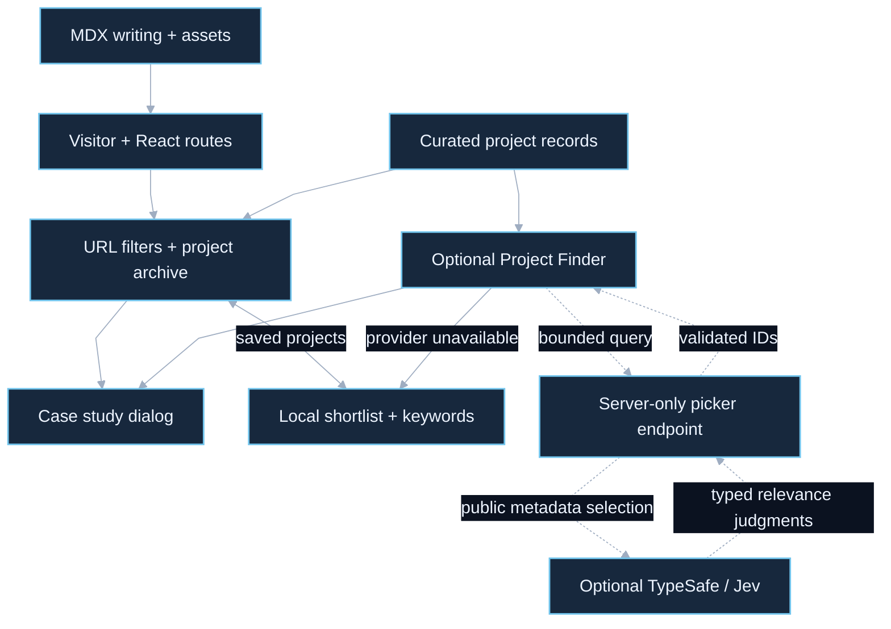

# Shaurya Portfolio: architecture case study

Curated project records drive a static React archive with optional server-side Jev discovery.

Source snapshot: `dc8e784e00b631376d8a4d31afc88a0e54c93151`. Reviewed on **2026-10-04**. This describes the selected committed source, excluding unrelated uncommitted work in the canonical checkout. It is not a runtime, provider, deployment or security certification.

## Overview

[Editable Mermaid](overview.mmd). Solid edges show the core flow; dashed edges show optional or separately invoked paths. Diagram connections summarize control/data flow rather than a complete import graph.

## Main flow

Vite builds the React application, routes and static assets. Project records and MDX writing supply curated content; archive filters and URL state determine visible projects and detail dialogs. Shortlists remain browser-local. The optional Project Finder sends a bounded query to a server endpoint, which selects existing project IDs through TypeSafe/Jev. Responses are checked against the known archive; unavailable inference falls back to local keyword matching.

## Engineering decision

Keep project content authoritative and curated, with deterministic browsing as the baseline. Jev may select from existing records, but does not invent projects or rewrite evidence. A server-only optional endpoint protects credentials while the local fallback keeps discovery usable when the provider is absent.

## Source map

| Component | Review path |
| --- | --- |
| Visitor + React routes | [src/app/App.jsx](../../src/app/App.jsx) |
| Curated project records | [src/data/projects.js](../../src/data/projects.js) |
| MDX writing + assets | [src/posts/index.js](../../src/posts/index.js) |
| URL filters + project archive | [src/components/Projects.jsx](../../src/components/Projects.jsx) |
| Case study dialog | [src/components/ProjectDetailDialog.jsx](../../src/components/ProjectDetailDialog.jsx) |
| Local project discovery helpers | [src/lib/projectFinder.js](../../src/lib/projectFinder.js) |
| Optional Project Finder | [src/components/ProjectFinder.jsx](../../src/components/ProjectFinder.jsx) |
| Server-only picker endpoint | [api/project-picker.js](../../api/project-picker.js) |
| Optional TypeSafe / Jev | [src/lib/projectFinder.js](../../src/lib/projectFinder.js) |

## Boundaries and limitations

- The server endpoint receives the query and selected public project metadata only; the browser never receives the provider key. The feature does not persist the query in browser storage or the page URL.
- Request budgets are held in server-process memory; they are not a global distributed quota. Live provider behavior and deployment were not exercised for these docs.
- Other projects’ architecture diagrams are delivered as documentation; this package does not change portfolio components or publish them into the live site.

## GitDiagram provenance

GitDiagram draft dated 2026-10-03 was inspected. Its broad page map is condensed; the reviewed overview adds the optional Project Finder, server credential boundary and local fallback.

[GitDiagram reference](https://gitdiagram.com/icecold009/shaurya-portfolio) · [Repository](https://github.com/icecold009/shaurya-portfolio)

The compact overview is a source-reviewed adaptation authored for this snapshot and rendered locally, not an unmodified GitDiagram export.

## Interview explanation

> The archive is curated data rendered by React, with URL-backed filtering and accessible details. Jev is an optional selector over existing records behind a server endpoint. When it is unavailable, local keyword matching still works and is labelled honestly.

## Verification and refresh

Documentation-only acceptance: validate every relative source link and commit-specific diagram link, render Mermaid, inspect the dark PNG for readability, inspect the complete diff, and obtain a bounded Jev diff review. The repository proposal contains no new binary images; separately delivered PNG previews are independently checked because Jev reviews text. Results and Jev coverage are recorded in this task’s delivery report rather than treated as application test evidence.

After an architecture change, inspect the new source, update this snapshot identifier, regenerate the overview from Mermaid, and recheck links and image appearance. Keep planned integrations explicitly separate from implemented paths.

## Review status

Integration is pending warning resolution. Earlier Jev uncertainty has not been accepted or waived. The proposed repository changes are text only, including embedded Mermaid; PNG previews are separate delivery outputs. Source claims describe this committed snapshot. The coverage register accounts for tracked paths and does not prove every execution path or deployed behavior.

## Detailed coverage

See [the subsystem diagram and complete tracked-file register](coverage.md) and [editable detail Mermaid](detail.mmd). This supplement records recovery, optional services, delivery boundaries and original-checkout drift beyond the overview.

[Documentation verification record](verification.md).
