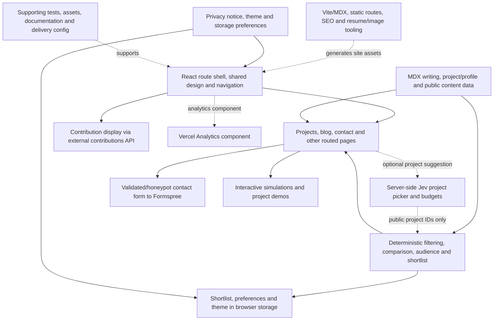

# Subsystem coverage register

Snapshot: `dc8e784e00b631376d8a4d31afc88a0e54c93151`. The overview is intentionally compact; this detail layer accounts for the selected Git-tracked tree. Inventory coverage is not proof of every behavior, dynamic dependency, ignored file or deployed system. Nodes group modules rather than reproducing every function. Credentials, local datasets and generated dependencies are excluded.

## Flow and boundary notes

- AnimatedRoutes.jsx defines home, projects, about, blog index/post, contact/thanks, work-with-me, privacy, terms, uses, artwork, certificates, achievements and the catch-all page. The PAGES node summarizes these routed surfaces; the full source-path inventory follows.

- The route shell includes home, projects, about, blog and slug, contact, work-with-me, thanks, privacy, terms, uses, artwork, certificates, achievements and a not-found route. Shared navigation, accessibility, motion, artwork and project simulations are part of the presentation layer.
- Project search/filtering, saved shortlist, comparison, skills/audience/tour helpers and local keyword fallback remain usable without the optional server-side Jev picker. The picker has bounded budgets and returns validated public project IDs; live provider success is not proved.
- Contact validates input and a honeypot, then transmits form fields to Formspree and handles success/error navigation. The contribution display fetches a third-party contributions API; these are distinct external services. Browser preferences/storage and legal/privacy-notice UI are separate boundaries. CookieBanner only dismisses a notice; it does not gate the Analytics component.
- MDX/public assets, static route generation, metadata/SEO, resume synchronization and image tooling belong to content/build delivery. They do not prove analytics, contact inbox delivery, hosting or a provider run.

## Original checkout differences

The original checkout was clean at audit.

## File accounting

268 tracked paths, each assigned exactly once below. Supporting items remain explicit without becoming runtime services. Root dependency/build/CI files and otherwise unassigned support files are in DELIVERY; that bucket must be inspected for misclassified runtime modules.

### UI: React route shell, shared design and navigation (67)

- `src/app/AnimatedRoutes.jsx`
- `src/app/App.jsx`
- `src/app/ScrollToTop.jsx`
- `src/components/Achievements.jsx`
- `src/components/AudioPlayground.css`
- `src/components/AudioPlayground.jsx`
- `src/components/AudioSignalExplorer.css`
- `src/components/AudioSignalExplorer.jsx`
- `src/components/BubbleField.css`
- `src/components/BubbleField.jsx`
- `src/components/Contact.jsx`
- `src/components/CookieBanner.jsx`
- `src/components/GitHubContributions.css`
- `src/components/GitHubContributions.jsx`
- `src/components/Hero.css`
- `src/components/Hero.jsx`
- `src/components/MediaDetailDialog.jsx`
- `src/components/PortfolioTour.css`
- `src/components/PortfolioTour.jsx`
- `src/components/ProjectComparison.css`
- `src/components/ProjectComparison.jsx`
- `src/components/ProjectDetailDialog.jsx`
- `src/components/ProjectFinder.css`
- `src/components/ProjectFinder.jsx`
- `src/components/ProjectStory.css`
- `src/components/ProjectStory.jsx`
- `src/components/ProjectTechnologyTag.jsx`
- `src/components/Projects.css`
- `src/components/Projects.jsx`
- `src/components/RouteMetadata.jsx`
- `src/components/SkillsProjectExplorer.css`
- `src/components/SkillsProjectExplorer.jsx`
- `src/components/layout/Footer.css`
- `src/components/layout/Footer.jsx`
- `src/components/layout/Navbar.jsx`
- `src/main.jsx`
- `src/styles/base/global.css`
- `src/styles/base/reset.css`
- `src/styles/base/typography.css`
- `src/styles/base/variables.css`
- `src/styles/components/buttons.css`
- `src/styles/components/cards.css`
- `src/styles/components/media-detail-dialog.css`
- `src/styles/components/modal.css`
- `src/styles/components/navbar.css`
- `src/styles/components/project-card.css`
- `src/styles/components/project-detail-dialog.css`
- `src/styles/components/project-technology-tag.css`
- `src/styles/components/section-heading.css`
- `src/styles/index.css`
- `src/styles/layout/container.css`
- `src/styles/layout/footer.css`
- `src/styles/layout/sections.css`
- `src/styles/pages/about.css`
- `src/styles/pages/achievements.css`
- `src/styles/pages/artwork.css`
- `src/styles/pages/blog.css`
- `src/styles/pages/certificates.css`
- `src/styles/pages/contact.css`
- `src/styles/pages/editorial-pages.css`
- `src/styles/pages/legal.css`
- `src/styles/pages/not-found.css`
- `src/styles/pages/projects.css`
- `src/styles/pages/uses.css`
- `src/styles/utilities/accessibility.css`
- `src/styles/utilities/animations.css`
- `src/styles/utilities/responsive.css`

### PAGES: Projects, blog, contact and other routed pages (19)

- `src/pages/about/AboutPage.css`
- `src/pages/about/AboutPage.jsx`
- `src/pages/achievements/AchievementsPage.jsx`
- `src/pages/artwork/ArtworkPage.jsx`
- `src/pages/blog/BlogPage.jsx`
- `src/pages/blog/BlogPostPage.jsx`
- `src/pages/certificates/CertificatesPage.jsx`
- `src/pages/certificates/certificatesData.js`
- `src/pages/contact/ContactPage.jsx`
- `src/pages/contact/ThankYouPage.jsx`
- `src/pages/home/Home.css`
- `src/pages/home/Home.jsx`
- `src/pages/not-found/NotFound.jsx`
- `src/pages/privacy/PrivacyPage.jsx`
- `src/pages/projects/ProjectsPage.jsx`
- `src/pages/terms/TermsPage.jsx`
- `src/pages/uses/UsesPage.jsx`
- `src/pages/work-with-me/WorkWithMePage.css`
- `src/pages/work-with-me/WorkWithMePage.jsx`

### CONTENT: MDX writing, project/profile and public content data (16)

- `src/data/artwork.js`
- `src/data/profile.js`
- `src/data/projects.js`
- `src/posts/30-days-of-ai.mdx`
- `src/posts/baseline-can-be-the-result.mdx`
- `src/posts/data-products-need-honesty.mdx`
- `src/posts/designing-for-the-fallback.mdx`
- `src/posts/generatedMetadata.js`
- `src/posts/index.js`
- `src/posts/past-papers-need-a-pipeline.mdx`
- `src/posts/patterns-to-practice-2025.mdx`
- `src/posts/prediction-needs-context.mdx`
- `src/posts/shazam-clone.mdx`
- `src/posts/shipping-is-a-design-decision.mdx`
- `src/posts/smallest-useful-version.mdx`
- `src/posts/study-progress-that-survives-refresh.mdx`

### FINDER: Deterministic filtering, comparison, audience and shortlist (16)

- `src/lib/audienceLens.js`
- `src/lib/audioSignalModel.js`
- `src/lib/blogSelection.js`
- `src/lib/contactValidation.js`
- `src/lib/githubContributions.js`
- `src/lib/mediaSelection.js`
- `src/lib/motion.js`
- `src/lib/profileLinks.js`
- `src/lib/projectComparison.js`
- `src/lib/projectEvidence.js`
- `src/lib/projectFinder.js`
- `src/lib/projectSearch.js`
- `src/lib/projectShortlist.js`
- `src/lib/projectSkills.js`
- `src/lib/readingTime.js`
- `src/lib/seoMetadata.js`

### AI: Server-side Jev project picker and budgets (1)

- `api/project-picker.js`

### BUILD: Vite/MDX, static routes, SEO and resume/image tooling (11)

- `index.html`
- `scripts/compress-images.js`
- `scripts/generate-brand-assets.mjs`
- `scripts/generate-static-routes.mjs`
- `scripts/lint-source.mjs`
- `scripts/pdf_thumbnails.py`
- `scripts/sync-post-metadata.mjs`
- `scripts/sync-resume.mjs`
- `scripts/verify-quality.mjs`
- `scripts/verify-static-integrity.mjs`
- `vite.config.js`

### POLICY: Privacy notice, theme and storage preferences (0)

External or cross-cutting concept; source is shared with other nodes.
### TEST (20)

- `tests/audienceLens.test.mjs`
- `tests/audioSignal.test.mjs`
- `tests/blogSelection.test.mjs`
- `tests/contactValidation.test.mjs`
- `tests/githubContributions.test.mjs`
- `tests/homePage.test.mjs`
- `tests/interactivePanels.test.mjs`
- `tests/introLoader.test.mjs`
- `tests/mediaSelection.test.mjs`
- `tests/portfolioTour.test.mjs`
- `tests/postContent.test.mjs`
- `tests/projectComparison.test.mjs`
- `tests/projectComparisonComponent.test.mjs`
- `tests/projectFinder.test.mjs`
- `tests/projectSearch.test.mjs`
- `tests/projectShortlist.test.mjs`
- `tests/projectSkills.test.mjs`
- `tests/resumeSync.test.mjs`
- `tests/seoMetadata.test.mjs`
- `tests/skillsProjectExplorer.test.mjs`

### DOC (7)

- `.github/copilot-instructions.md`
- `.github/skills/code-review/SKILL.md`
- `AGENTS.md`
- `README.md`
- `TODO.md`
- `docs/page-inventory.md`
- `docs/portfolio-remediation.md`

### ASSET (104)

- `artifacts/case-study-walkthrough-dark.png`
- `artifacts/mobile-navigation-dark.png`
- `artifacts/portfolio-home-dark.png`
- `public/apple-touch-icon.png`
- `public/artwork/compressed/piece-01.webp`
- `public/artwork/compressed/piece-02.webp`
- `public/artwork/compressed/piece-03.webp`
- `public/artwork/compressed/piece-04.webp`
- `public/artwork/compressed/piece-05.webp`
- `public/artwork/compressed/piece-06.webp`
- `public/artwork/compressed/piece-07.webp`
- `public/artwork/compressed/piece-08.webp`
- `public/artwork/compressed/piece-09.webp`
- `public/artwork/compressed/piece-10.webp`
- `public/artwork/compressed/piece-11.webp`
- `public/artwork/compressed/piece-12.webp`
- `public/artwork/compressed/piece-13.webp`
- `public/artwork/compressed/piece-14.webp`
- `public/artwork/compressed/piece-15.webp`
- `public/artwork/compressed/piece-16.webp`
- `public/artwork/compressed/piece-17.webp`
- `public/artwork/compressed/piece-18.webp`
- `public/artwork/compressed/piece-19.webp`
- `public/artwork/compressed/piece-20.webp`
- `public/artwork/compressed/piece-21.webp`
- `public/certificates/images/cert-30-days-of-AI.webp`
- `public/certificates/images/cert-AI-fluency-Capabilities-and-limitations.webp`
- `public/certificates/images/cert-Amazon-Data-analysis.webp`
- `public/certificates/images/cert-Amazon-Future-careers-experience.webp`
- `public/certificates/images/cert-Claude-Code-In-Action.webp`
- `public/certificates/images/cert-Clever-Harvey-JuniorMBA.webp`
- `public/certificates/images/cert-Freecodecamp-Data.webp`
- `public/certificates/images/cert-Freecodecamp-Web.webp`
- `public/certificates/images/cert-IIT-Madras-Data-Science.webp`
- `public/certificates/images/cert-IYMC-Final-Round-Silver.webp`
- `public/certificates/images/cert-IYMC-Performance-Report.webp`
- `public/certificates/images/cert-IYMC-Pre-Final-round.webp`
- `public/certificates/images/cert-IYMC-Qualification-Round.webp`
- `public/certificates/images/cert-Immerse-Certified-Entrant.webp`
- `public/certificates/images/cert-Immerse-Essay.webp`
- `public/certificates/images/cert-Immerse-Gmail1-Essay-Scholarship.webp`
- `public/certificates/images/cert-Immerse-Gmail2-Essay-Scholarship.webp`
- `public/certificates/images/cert-MIT-EWB-Individual.webp`
- `public/certificates/images/cert-MIT-EWB-Participation.webp`
- `public/certificates/images/cert-MIT-EWB-Team.webp`
- `public/certificates/images/cert-NFO-Performance-Report-2025.webp`
- `public/certificates/images/cert-NFO-Performance-Report-2026.webp`
- `public/certificates/images/cert-NFO-Stage-1.webp`
- `public/certificates/images/cert-NFO-Stage-National.webp`
- `public/certificates/images/cert-Udemy-Web-development.webp`
- `public/certificates/images/cert-Vivek-agro-internship.webp`
- `public/certificates/images/cert-Wharton-Investment-Competition.webp`
- `public/certificates/pdfs/cert-AI-fluency-Capabilities-and-limitations.pdf`
- `public/certificates/pdfs/cert-Amazon-Data-analysis.pdf`
- `public/certificates/pdfs/cert-Amazon-Future-careers-experience.pdf`
- `public/certificates/pdfs/cert-Claude-Code-In-Action.pdf`
- `public/certificates/pdfs/cert-Clever-Harvey-JuniorMBA.pdf`
- `public/certificates/pdfs/cert-IYMC-Final-Round-Silver.pdf`
- `public/certificates/pdfs/cert-IYMC-Performance-Report.pdf`
- `public/certificates/pdfs/cert-IYMC-Pre-Final-round.pdf`
- `public/certificates/pdfs/cert-IYMC-Qualification-Round.pdf`
- `public/certificates/pdfs/cert-Immerse-Certified-Entrant.pdf`
- `public/certificates/pdfs/cert-Immerse-Essay.pdf`
- `public/certificates/pdfs/cert-Immerse-Gmail1-Essay-Scholarship.pdf`
- `public/certificates/pdfs/cert-Immerse-Gmail2-Essay-Scholarship.pdf`
- `public/certificates/pdfs/cert-MIT-EWB-Individual.pdf`
- `public/certificates/pdfs/cert-MIT-EWB-Participation.pdf`
- `public/certificates/pdfs/cert-MIT-EWB-Team.pdf`
- `public/certificates/pdfs/cert-NFO-Performance-Report-2025.pdf`
- `public/certificates/pdfs/cert-NFO-Performance-Report-2026.pdf`
- `public/certificates/pdfs/cert-NFO-Stage-1.pdf`
- `public/certificates/pdfs/cert-NFO-Stage-National.pdf`
- `public/certificates/pdfs/cert-Vivek-agro-internship.pdf`
- `public/favicon-16.png`
- `public/favicon-32.png`
- `public/favicon.png`
- `public/images/shaurya-portrait.jpeg`
- `public/map-bengaluru.png`
- `public/og-image.png`
- `public/projects/audio-recognition-fft.png`
- `public/projects/car-price-predictor-cover-v2.webp`
- `public/projects/car-price-predictor-cover.webp`
- `public/projects/code-racer-logo.png`
- `public/projects/f1-predicted-vs-actual-2023.png`
- `public/projects/face-attendance-cover-v2.webp`
- `public/projects/face-attendance-cover.webp`
- `public/projects/icecold-sprint-cover-v2.webp`
- `public/projects/icecold-sprint-cover.webp`
- `public/projects/movie-tracker-production.png`
- `public/projects/open-source-practice-cover-v2.webp`
- `public/projects/open-source-practice-cover.webp`
- `public/projects/past-paper-ai-cover-v2.webp`
- `public/projects/past-paper-ai-cover.webp`
- `public/projects/stadiumpulse-live-login.png`
- `public/projects/token-router-cover-v2.webp`
- `public/projects/token-router-cover.webp`
- `public/projects/touchscreen-launchpad.svg`
- `public/resume-preview.png`
- `public/resume.pdf`
- `public/robots.txt`
- `public/site-icon-192.png`
- `public/site-icon-512.png`
- `public/site.webmanifest`
- `public/sitemap.xml`

### DELIVERY (7)

- `.gitattributes`
- `.github/workflows/quality.yml`
- `.gitignore`
- `.vscode/settings.json`
- `package-lock.json`
- `package.json`
- `vercel.json`
